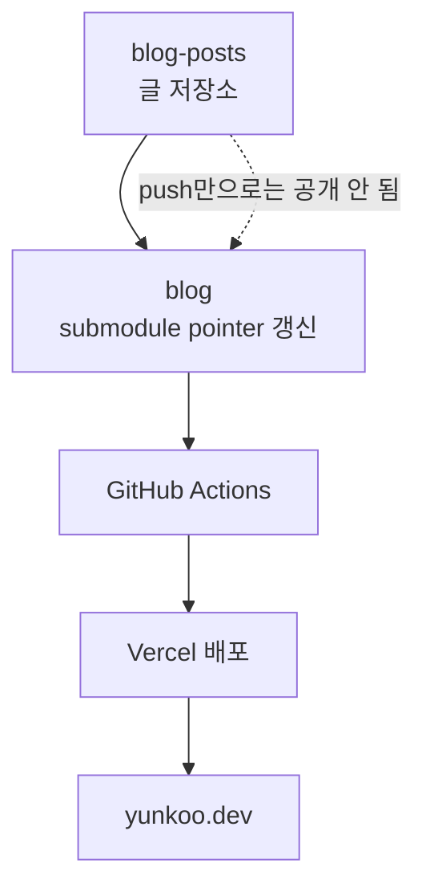

# [yunkoo.dev](https://yunkoo.dev)

Next.js 기반 개인 기술 블로그입니다.

글 작성 저장소와 블로그 앱 저장소를 분리해 운영합니다.

## 소개

이 저장소는 `yunkoo.dev`를 구성하는 Next.js 블로그 앱입니다.
블로그 화면, 라우팅, MDX 렌더링, SEO 메타데이터, 배포 파이프라인을 담당합니다.

글 원본은 별도 private 저장소에서 관리하고, 이 저장소는 배포할 글 커밋을 submodule pointer로 고정합니다.
덕분에 글을 자유롭게 작성하되, 공개 시점은 `blog` 저장소에서 명시적으로 제어할 수 있습니다.

## Architecture



글은 `blog-posts`에서 작성하지만, 실제 배포는 `blog` 저장소의 submodule pointer가 갱신될 때만 실행됩니다.

## 구동 방식

1. `blog-posts`에서 글을 자유롭게 작성하고 수정한 뒤 최종안을 올립니다.
2. 게시할 시점에 `blog` 저장소의 `content-source/posts` submodule pointer를 최종 글 커밋으로 갱신합니다.
3. `blog` 저장소의 `main`에 변경이 반영되면 GitHub Actions가 실행됩니다.
4. Actions는 `blog` 저장소에 기록된 글 커밋을 가져온 뒤 Vercel CLI로 production 배포를 수행합니다.

## 운영 문서

로컬 실행, secrets 설정, 글 게시 절차는 [GitHub Wiki](https://github.com/yunkooo/blog/wiki)에 정리했습니다.

## 사용 기술

| 구분 | 라이브러리 |
| --- | --- |
| Framework | Next.js 16, React 19 |
| Styling | Tailwind CSS 4 |
| Content | MDX, gray-matter, next-mdx-remote |
| Tooling | TypeScript, ESLint |
| Deployment | GitHub Actions, Vercel CLI |

## 폴더 구조

```txt
src/app
  ├─ (site)              # 블로그 공개 라우트
  ├─ robots.ts           # robots.txt
  └─ sitemap.ts          # sitemap.xml

src/features/posts
  ├─ data                # 글 데이터 조회, frontmatter 파싱, 타입
  ├─ components          # MDX 본문 렌더링
  └─ utils               # post 관련 유틸

src/components           # 공통 UI
content-source/posts     # private posts repo submodule
```

## Notes

- 글을 SSG로 빠르게 제공하고 SEO를 안정적으로 관리
- 추후 댓글·좋아요 같은 부가 기능은 ISR로 확장할 수 있게 설계
- 글 작성과 앱 개발을 분리해 초안 작업을 자유롭게 하고, 명시적으로 반영한 글만 배포되도록 구성
